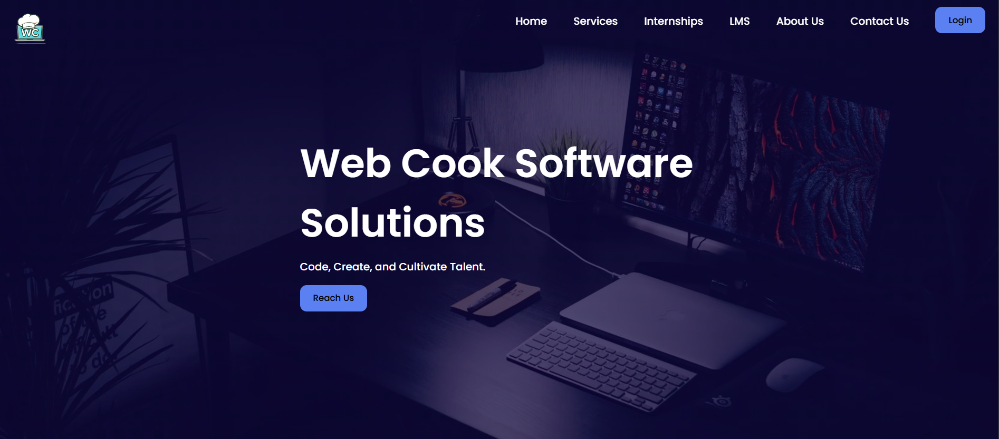
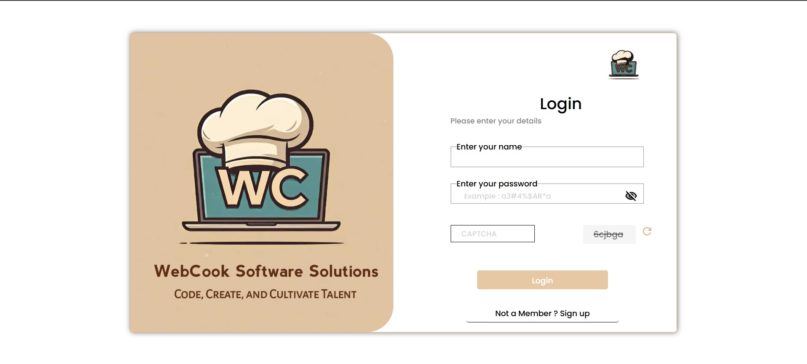
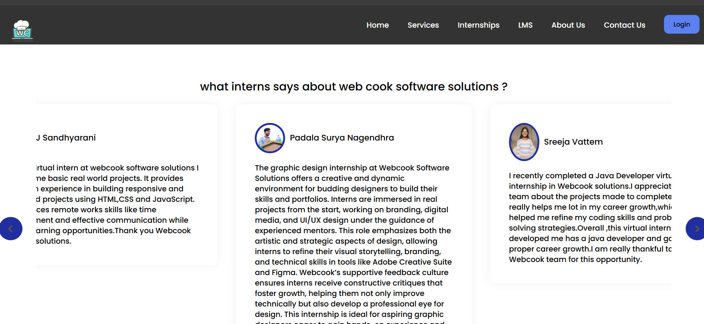
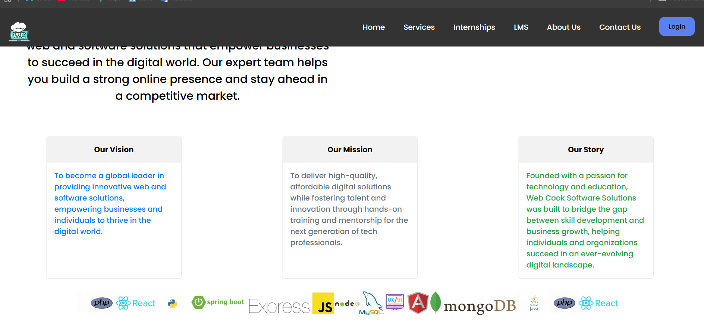

# Webcook

  
*Webcook is a full-stack web application built using the MERN stack (MongoDB, Express.js, React.js, Node.js). This project provides [brief purpose of the app, such as  "a service management platform"].*

---

## Features

  

  

  

  

- **Dynamic UI**: The frontend is built with React, ensuring a smooth and responsive user experience. Material-UI is used for a modern design.  
- **RESTful APIs**: The backend uses Express.js to create RESTful APIs that handle CRUD operations for user data, services, and other resources stored in MongoDB.  

---

## Tech Stack

The application is built using the following technologies:  
- **Frontend**:  
  - **React.js**: For building dynamic, single-page user interfaces.  
  - **Material-UI / Bootstrap**: For responsive design and modern UI components.  
- **Backend**:  
  - **Node.js**: JavaScript runtime used to build scalable backend services.  
  - **Express.js**: Web framework for building RESTful APIs.  
- **Database**:  
  - **MongoDB**: NoSQL database used to store application data.  
  - **Mongoose**: ODM (Object Data Modeling) library for MongoDB and Node.js.

---

